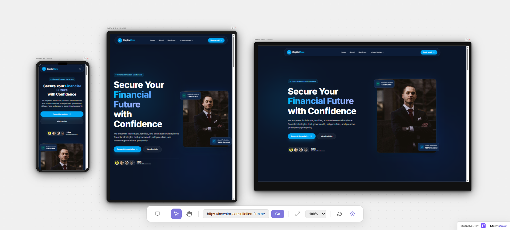

# CapitalCore — Institutional Investor Landing Page



🌐 **Live Demo:** [https://shepherd-bit.github.io/01-react-investor/](https://shepherd-bit.github.io/01-react-investor/)

> An interactive, modern, high-converting investor landing page designed for institutional asset managers, venture capital firms, and high-net-worth advisory services. Built with React, GSAP, Tailwind CSS, and Lucide/React Icons.

---

## 🌟 Key Features

* **Hero & Interactive Video Spotlight:** High-impact value proposition with smooth animated entrances and background video/modal triggers.
* **Featured on Global Stages ("As Seen In"):** Interactive showcase highlighting keynote talks (e.g., TEDx) and top-tier financial publications (*Forbes*, *Bloomberg*, *WSJ*, *FT*, *TechCrunch*).
* **Success Stories Carousel & Modal:** Interactive portfolio case studies with detailed metrics, automated 15-second transitions, and slide-over story drawers.
* **Interactive Financial Calculators & Dashboards:** Embedded tools for calculating risk-adjusted returns and capital allocation models.
* **Institutional Security & Compliance:** Regulatory disclaimers, SEC/FCA compliance callouts, and multi-tier security trust badges.
* **Sleek Dark Theme UI:** Designed with high contrast, modern typography (Inter font), smooth borders, and responsive grid layouts.

---

## 🛠️ Tech Stack

* **Frontend Framework:** [React 18](https://react.dev/)
* **Build Tool:** [Vite](https://vitejs.dev/)
* **Animations:** [GSAP (GreenSock Animation Platform)](https://gsap.com/) & `@gsap/react`
* **Styling:** [Tailwind CSS](https://tailwindcss.com/)
* **Icons:** [React Icons (`react-icons/fi`)](https://react-icons.github.io/react-icons/)
* **Linting & Code Quality:** [ESLint](https://eslint.org/)

---

## 📁 Project Structure

```text
├── public/
│   ├── logos/             # Press, partner, and client monochrome SVG logos
│   └── media/             # Video thumbnails, hero assets, and README preview
├── src/
│   ├── components/
│   │   ├── Navbar.jsx            # Dynamic navigation header
│   │   ├── Hero.jsx              # Hero section with interactive CTA
│   │   ├── Features.jsx          # "As Seen In" press & keynote showcase
│   │   ├── SuccessStories.jsx    # Portfolio case studies & auto-carousel
│   │   ├── AboutFounder.jsx      # Founder spotlight & background
│   │   ├── Services.jsx         # Investment advisory offerings
│   │   └── Footer.jsx            # Institutional footer with newsletter
│   ├── App.jsx                   # Root layout component
│   ├── index.css                 # Global CSS and Tailwind imports
│   └── main.jsx                  # Application entry point
├── package.json
└── README.md